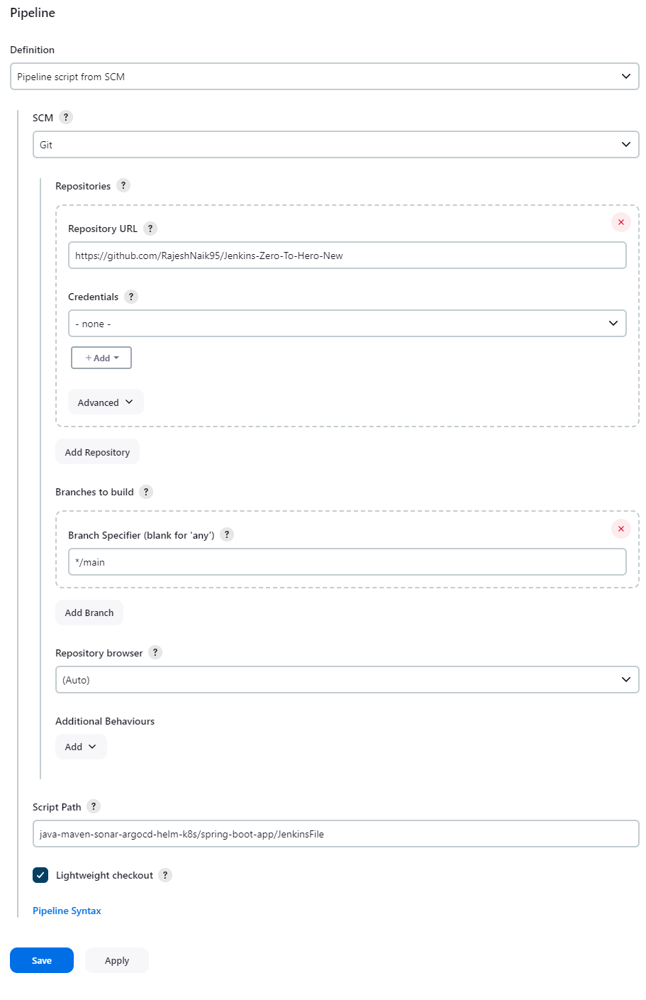
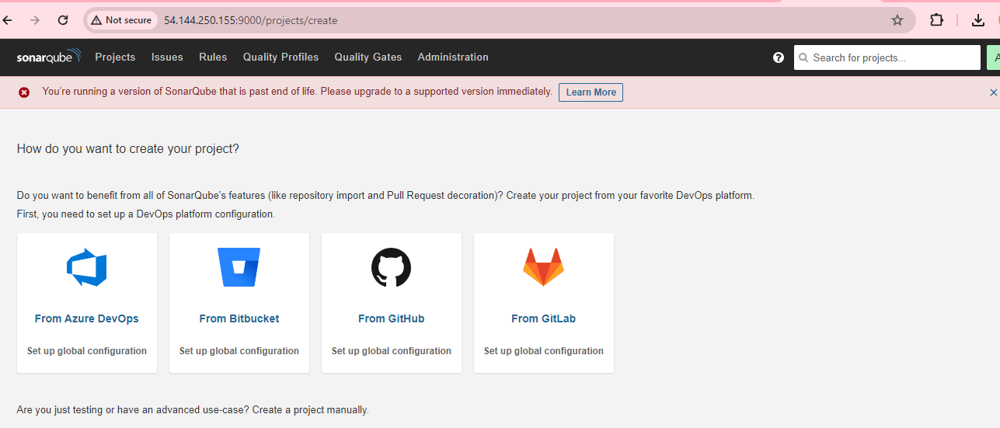
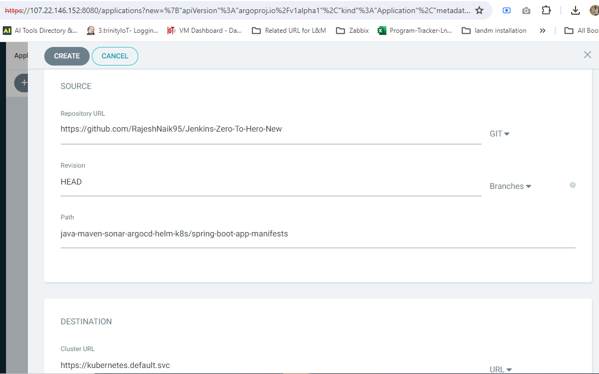

**Jenkins Pipeline for Java based application using Maven, SonarQube,
Argo CD, Helm and Kubernetes**


Installation on EC2 Instance:

-   Go to AWS Console

-   Instances(running)

-   Launch instances


> Install Java:

1.  Update package lists:
 ```console
 sudo apt update
 ```

2.  Install OpenJDK 11: 
```console
sudo apt install openjdk-11-jre
```

3.  Verify Java installation: java -version

> **Install Jenkins:**

-   Import Jenkins repository key: 
```console
curl -fsSL
    https://pkg.jenkins.io/debian/jenkins.io-2023.key \| sudo tee
    /usr/share/keyrings/jenkins-keyring.asc \> /dev/null
```

-   Add Jenkins repository: 
```console
echo deb
    \[signed-by=/usr/share/keyrings/jenkins-keyring.asc\]
    https://pkg.jenkins.io/debian binary/ \| sudo tee
    /etc/apt/sources.list.d/jenkins.list \> /dev/null

```
-   Update package lists:
```console
 sudo apt-get update
```

-   Install Jenkins: 
```console
sudo apt-get install jenkins
```

Note: Ensure inbound traffic rules allow TCP 8080.


-   Access Jenkins:

-   Login using:


-   Retrieve admin password: sudo cat
    /var/lib/jenkins/secrets/initialAdminPassword


**\-\-\-\-\-\-\-\-\-\-\-\--\>create admin
user\-\-\-\-\-\-\-\-\-\-\--\>**


**\-\-\-\-\-\-\-\-\-\-\-\--\>[Jenkins Installation is
Successful]{.mark}.\-\-\-\-\-\-\-\-\-\-\--\>**

**create pipeline**

-   Navigate to your Jenkins dashboard.

-   Click on New Item.

-   Enter a name for your pipeline and select Pipeline as the project
    type.

-   Click OK to proceed.

In the pipeline configuration page:

-   Scroll down to the Pipeline section.

-   In the Definition dropdown, select Pipeline script from SCM.

-   Choose your preferred SCM (Git, GitHub, etc.).

-   Enter the repository URL where your Jenkinsfile is stored.

-   If needed, specify the branch or tag.

-   Save the configuration.

**Note: Ensure that your Jenkins server has the necessary permissions to
access the repository.**

v



In this pipeline we are using docker as agent so for that need to
install docker pluggin and docker in jenkins server

**Install Docker Plugin:**

-   Go to the Jenkins dashboard.

-   Click on Manage Jenkins in the sidebar.

-   Select Manage Plugins.

-   Go to the Available tab.

-   Search for \"Docker\" in the filter box.

-   Check the box next to Docker Plugin.

-   Click Install without restart.


install docker in jenkins server

**Install Docker:**
```console

sudo apt update

sudo apt install docker.io
```

**Grant Permissions:**

```console
sudo su -

usermod -aG docker jenkins

usermod -aG docker ubuntu

systemctl restart docker
```

Once you are done with the above steps, it is better to restart Jenkins.

http://\<ec2-instance-public-ip\>:8080/restart

**Install SonarQube:**

-   Install SonarQube Scanner Plugin: Jenkins Dashboard -\> Manage
    Jenkins -\> Plugins -\> Install SonarQube Scanner.


**Install and Configure SonarQube Server**

```console
$apt install unzip

$adduser sonarqube

su - sonarqube

wget
[[https://binaries.sonarsource.com/Distribution/sonarqube/sonarqube-9.4.0.54424.zip]{.underline}](https://binaries.sonarsource.com/Distribution/sonarqube/sonarqube-9.4.0.54424.zip)

unzip \*

chmod -R 755 /home/sonarqube/sonarqube-9.4.0.54424

chown -R sonarqube:sonarqube /home/sonarqube/sonarqube-9.4.0.54424

cd sonarqube-9.4.0.54424/bin/linux-x86-64/

./sonar.sh start

```
sonar kube installed it will access in 9000 port

[<https://ec2> instance ip :9000]{.underline}

-   Add 9000 port in EC2 inbond rule


**Connect Jenkins with SonarQube:**

Now we can acess sonarqkube url

Default User name and password is admin \-\-- admin




**Connect SonarQube with Jenkins:**

1\. Generate API Token in SonarQube:

-   Log in to your SonarQube instance.

-   Navigate to your profile settings.

-   Click on Security or My Account.

-   Select Security.

-   Scroll down to the Generate Tokens section.

-   Provide a name for your token and click Generate.

-   Copy the generated token.


> Add API Token to Jenkins Credentials:

-   Go to your Jenkins dashboard.

-   Click on Manage Jenkins in the sidebar.

-   Select Manage Credentials.

-   Click on (global) or the appropriate domain.

-   Click on Add Credentials.

-   Choose Secret text as the kind.

-   Paste the copied API token in the Secret field.

-   Optionally, provide an ID and description.

-   Click OK to save the credentials.


[Continuous Integration (CI) Setup Complete]{.mark}.

**Continuous Deployment (CD) Setup:**

**Install MiniKube on a new EC2 instance:**

> **Installing Docker:**

**Update package lists:**

```console
sudo apt-get update
```

**Install Docker:**

```console
sudo apt-get install docker.io -y

sudo usermod -aG docker \$USER && newgrp docker

```
**Update system packages and install MiniKube dependencies:**

```console
sudo apt update && sudo apt upgrade

sudo apt install -y curl wget apt-transport-https
```

**Download the latest MiniKube release:**

```console
curl -LO
https://storage.googleapis.com/minikube/releases/latest/minikube-linux-amd64

```
**Install MiniKube:**

```console
sudo install minikube-linux-amd64 /usr/local/bin/minikube
```

**Verify the installation by checking the MiniKube version:**
```console

minikube version
```

**You should see an output similar to:**


```console
minikube version: v1.32.0
```


commit: 8220a6eb95f0a4d75f7f2d7b14cef975f050512d

**Download kubectl:**

```console
curl -LO
https://storage.googleapis.com/kubernetes-release/release/\$(curl -s
https://storage.googleapis.com/kubernetes-release/release/stable.txt)/bin/linux/amd64/kubectl
```

**Make kubectl executable:**

```console
chmod +x kubectl
```

**Move kubectl to /usr/local/bin to make it available system-wide:**

```console
sudo mv kubectl /usr/local/bin/
```

**Check the kubectl version:**

```console
kubectl version -o yaml
```

**Start MiniKube with Docker driver:**

```console
minikube start \--driver=docker \--force
```

**Check the status of MiniKube:**

minikube status

minikube

type: Control Plane

host: Running

kubelet: Running

apiserver: Running

kubeconfig: Configured

**Setup Argo CD:**

-   Install Operator Lifecycle Manager (OLM).
```console

curl -sL
[[https://github.com/operator-framework/operator-lifecycle-manager/releases/download/v0.27.0/install.sh]{.underline}](https://github.com/operator-framework/operator-lifecycle-manager/releases/download/v0.27.0/install.sh)
\| bash -s v0.27.0

```
```console
• Install Argo CD Operator.

\$ kubectl create -f
[[https://operatorhub.io/install/argocd-operator.yaml]{.underline}](https://operatorhub.io/install/argocd-operator.yaml)

\$ kubectl get csv -n operators

```
-   Deploy Argo CD controller.

-   Access Argo CD UI using generated credentials.

Deploy Argo CD Controller:

Create a YAML file named argocd-basic.yml with the following content:

apiVersion: argoproj.io/v1alpha1

kind: ArgoCD

metadata:

name: example-argocd

labels:

example: basic

spec: {}

Apply the YAML file to create the Argo CD instance:

\$kubectl apply -f argocd-basic.yml

Check the status of the Argo CD pods:

\$kubectl get pod


Check the services to get the URL for accessing Argo CD:

\$kubectl get svc


Edit the service to change the cluster IP to node port for browser
access:

```console
$kubectl edit svc example-argocd-server
```


> Access Argo CD UI:

Use port-forwarding to access the Argo CD UI:

```console
$kubectl port-forward svc/example-argocd-server -n default \--address
0.0.0.0 8080:443
```


Use the following credentials to login:

-   Username: admin

-   Password: (Decrypt the encrypted password using the command below)

echo dlAzcDBaeFJmWUw4RGFuaEd1U0pGYjlYano1Z1dIY3M= \| base64 -d


Add Docker Hub and GitHub Credentials in Jenkins:

> Docker Hub Credentials:

-   Navigate to your Jenkins dashboard.

-   Click on Manage Jenkins in the sidebar.

-   Select Manage Credentials.

-   Click on (global) or the appropriate domain.

-   Click on Add Credentials.

-   Choose Username with password as the kind.

-   Enter your Docker Hub username and password.

-   Optionally, provide an ID and description.

-   Click OK to save the credentials.


> GitHub Credentials:

-   Follow the same steps as above but choose Secret text as the kind.

-   Enter your GitHub personal access token or password.

-   Optionally, provide an ID and description.

-   Click OK to save the credentials.


**Build Pipeline:**

-   Ensure all configurations, including linking your Jenkinsfile,
    setting up Docker and Maven plugins, and defining stages, are
    completed.

-   Once the pipeline is set up, go to the Jenkins dashboard.

-   Click on your pipeline project.

-   Click on Build Now to trigger a build.

-   Jenkins will start the build process. You can monitor the progress
    in the Jenkins interface.

-   Upon successful completion, you should see \"Build Success\" in the
    build history.


**[Build
Success\...\...\...\...\...\...\...\...\...\...\...\...\...\...\...\...\...\...\...\...\...\...\...\...\...\...\...\...\...\.....]{.mark}**

**Post-Build Actions:**

-   Verify that Docker images have been updated in your Docker Hub
    repository.

-   Check the build artifacts and logs for any errors or warnings.

-   If everything looks good, proceed with further deployment steps as
    per your pipeline configuration.


**Deploy Application to Minikube Cluster using Argo CD:**

> Configure Argo CD Application:

-   Open the Argo CD UI in your browser.

-   Log in using your credentials.

-   Navigate to the Applications tab.

-   Click on Create Application.

-   Fill in the application details, including the Git repository URL,
    target revision, and sync policy.

-   Click on Create to add the application.




> **Trigger Synchronization:**

-   Once the application is created, Argo CD will automatically
    synchronize with the Git repository.

-   You can also manually trigger synchronization by clicking on the
    Sync button next to the application.


> Monitor Deployment:

-   Monitor the deployment progress in the Argo CD UI.

-   Wait for the application to be deployed successfully.


**Access Application:**

-   Once the deployment is complete, you can access your application.

-   To access a service running in the Minikube cluster, you can use
    port-forwardin

\$kubectl get svc


kubectl port-forward \--address 0.0.0.0 svc/\<service-name\> 8080:80

Replace \<service-name\> with the name of your service.

-   Open your browser and navigate to http://localhost:8080 to access
    your application.

[**Now we can able to access in
browser**\...\...\...\...\...\...\...\...\...\...\...]{.mark}


**THANK You......**
